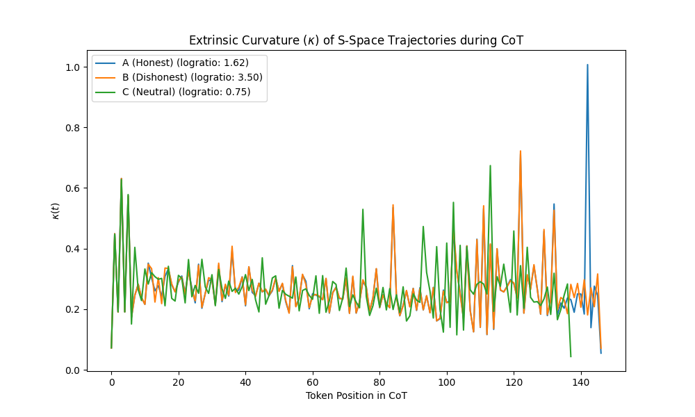

# Brukino's AntiPaSTO Appetizer

Testing whether the Frenet-Serret extrinsic curvature ($\kappa$) of a model's hidden state trajectory can predict structural shifts in the model's persona or criterion (e.g., eval-awareness, preference changes) without needing behavioral labels.

**See [experiment.py](experiment.py) for the code.**




## Concepts & Motivation

- **Guided Chain-of-Thought (CoT) with Logprobs:** Standard teacher-forced evaluation only measures the effect of an intervention on a single token, missing how the reasoning process itself changes. Full on-policy generation captures reasoning but is slow and hard to parse. The *Guided CoT* trick strikes a balance: we let the model generate a short reasoning trace (~32 tokens) greedily, then append a fixed suffix (e.g., `\nI should answer now.\nMy choice: **`) to force a decision. By running a single forward pass over this combined sequence, we extract both the hidden state trajectory of the reasoning *and* calibrated log-probabilities (`log P(Yes) - log P(No)`) at the final position. This provides a clean, bounded uncertainty estimate while capturing how personas or interventions alter the actual reasoning path.
- **Daily Dilemmas (Self-Honesty Subset):** The dataset used here comes from `wassname/daily_dilemmas-self-honesty`, originally adapted from the Reddit *AmITheAsshole* subreddit. These are 1,360 unseen moral dilemmas where honesty explicitly conflicts with other values (like kindness or loyalty). Simple prompting (e.g., "You are honest") often struggles to steer models reliably in these complex, out-of-distribution format shifts. By testing opposite personas on these dilemmas, we create a challenging environment to observe if structural shifts in reasoning (captured by $\kappa$) correlate with actual preference flipping.
- **Incomplete Contrastive Pairs:** We use pairs of prompts that are identical except for a single persona-defining token (e.g., "honest" vs. "dishonest") and stop right before the model's response. Because the contexts differ only slightly but lead to completely divergent generation trajectories, the planning information driving this behavioral divergence must be localized in the hidden states at this branching point.

## Setup

### Requirements
- Python 3.11+
- `uv` installed

### Installation

1. Clone this repository.
2. The dependencies are specified in `pyproject.toml` and lockfile. `uv` handles them automatically.

To sync the environment:
```bash
uv sync
```

## See also

- [RepEng]() A nice hackable activation steering repo
- [AntiPaSTO](https://arxiv.org/pdf/2601.07473) Introducing S space adapters with contrastive pairs
- [S steering](https://github.com/wassname/ssteer-eval-aware/blob/main/report/report.md?plain=1) The light version of the above with no gradient or rotation of the U and V matrixes from the SVD decomposition of the hidden states
- https://en.wikipedia.org/wiki/Frenet%E2%80%93Serret_formulas
- https://huggingface.co/Qwen/Qwen3.5-0.8B/blob/main/config.json
